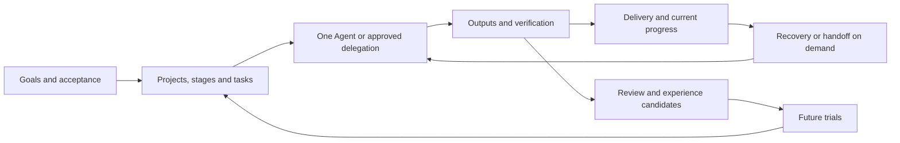

# MALTS Core Design

This document explains MALTS as one system: problems, objectives, the connection between delivery/scheduling/Growth and mechanisms supporting them. Current version is2.0.0. Historical records retain their original meaning. See [Usage](USAGE.md) and the [State Contract](V2_STATE_CONTRACT.md).

## 1. Problem definition

Single-turn capability differs from reliable long-project delivery. An executor may solve a local problem but lose constraints later; separate Agents may return artifacts without integration; an external effect may occur before an interrupted receipt. Projects need stable goals/progress/evidence beyond temporary conversation.

Continuity means that a later executor can identify intent, plans, observed results, unmet conditions and eligible next work. It includes understanding, execution and verification and cannot be supplied by summaries, labels or more Agents alone.

## 2. Objectives and principles

**Preserve intent.** Original/current goals, exclusions and acceptance remain traceable; material revisions are explicit rather than redefining success around completed fragments.

**Default to simple work.** One Agent executes ordinary tasks continuously. Scale/recovery value determine persistence; reports/handoffs/deep review serve actual purposes.

**Make effects checkable/recoverable.** Permission, preparation, effects and acceptance are separate. Interruption protects user data, subsequent work and consumed budgets.

**Delegate work, retain responsibility.** Separate investigation/implementation/verification when useful; the main Agent owns planning, resources, integration and acceptance.

**Assess improvement through facts.** Sourced/scoped actions are checked in future work; neutral/harmful/unknown results remain and unsupported lessons can be withdrawn.

**Control governance cost.** Records/checks/executors must improve recovery, verification, delivery or reuse. Do not turn every mistake into a permanent prompt or measure quality by process count.

## 3. Overall operating model

Delivery turns goals into accepted outputs. Scheduling preserves progress across rounds/stages/executors. Growth assesses methods for future use. Verification is their shared input.

These are not mandatory ceremonies every turn. Simple work uses delivery, long work adds persistence/recovery, real signals justify review and valuable authorized separation enables delegation.

## 4. Work hierarchy and completion

Projects define overall/global acceptance, stages bounded delivery, tasks executable outputs. Each accepts proof of its own scope. Task success does not close a stage; stage closure does not finish ongoing maintenance.

Tasks bind goals, inputs, scope, dependencies, acceptance and outputs. Useful decomposition produces checkable results, not maximum task count. Sequence dependencies and assess independent work for parallelism. Distinguish new requirements from approved scope without repeated approval for necessary local repairs.

Current implementation versions definitions and binds tasks to exact stage plans/predecessors to reject stale assumptions. Users need clear goals/progress, not internal IDs. Read current queues/context and locate history by purpose.

## 5. Workflows, Skills, templates and tools

Workflows cover clarification, project setup, long management, current tasks, handoff, review, lightweight Growth and scheduling. Skills package methods, templates aid drafting, checklists inspect outputs and tools implement deterministic state/file actions. They support one project process instead of parallel state systems.

Skills provide no permission. Tools cannot replace business judgment, model ratings cannot manufacture acceptance, and Host configuration cannot prove actual tool/process behavior.

## 6. Single Agent, collaboration and resources

Single Agent reduces communication/synchronization/integration overhead. Independent exploration/verification and separate modules can help, depending on resources and dependencies.

Delegation declares goals, inputs, scope, outputs, budgets and verification. Editors/files/services/environments/devices can be implicit shared resources. Different directories do not prove independence. Inspect Host execution/stop capabilities before sharing, serialization, exclusion or isolation.

The main Agent checks actual integration. Agreement, success returns and reports are insufficient. Pause/cancel/successor/exit are distinct; uncertainty and consumed allowances survive new rounds.

## 7. Artifacts, reports and handoffs

Record content, ownership, revision, provenance and dependencies separately. Verify current sharing eligibility; old references cannot silently promote superseded/retired artifacts to new content.

Reports explain outputs/evidence; handoffs explain current state/unresolved work/next steps. Derive them on demand and preserve manual content. Publication compares sources/preimages instead of overwriting newer facts. Old hashes do not certify edited reading copies.

## 8. Experience and Growth

Review begins from actual correction, failed verification, recovery, repeated issues or useful methods. Lightweight routing decides depth; deeper review explains causes, applicability and actions. No-signal success stays quiet.

Candidates specify sources, applicability, actions, checks and withdrawal. The original event proposes a candidate but is not future-use proof. Later tasks need eligible/comparable evidence. Preserve failed/neutral/unknown outcomes; counterevidence/source withdrawal stops affected reuse.

Project recording, trials and global Skill/rule changes have separate permission scopes. Encryption does not authorize public/Growth use; reviewed derivatives and purposes remain necessary. The design supports controlled improvement without presuming benefit.

## 9. Cost and stopping conditions

Costs include preparation/execution/wait/integration/verification/repair, not only response time. Account for coordination in parallel comparisons; smaller reference sets alone do not prove model token savings.

Bounded reads, valid-evidence reuse and risk-specific checks control overhead. Budgets retain consumption across recovery. Each round ends at a real deliverable, decision, checkpoint or failure condition; complete the goal without unlimited side branches.

## 10. Installation, adapters, languages and safety

Installation distributes an immutable runtime and native tool entries. Adapters preserve loading/permission conventions while the shared core owns common state/recovery. Installation, adoption and native behavior are separate evidence layers.

English/Chinese guides describe one state; fields remain stable and authored content retains its language. Safety includes exact permission, important preimages, provenance, protected-content purposes, stale-input rejection and external writers. Current DPAPI protection is Windows current-user Data Protection API, limiting cross-user recovery. Never manually patch immutable generations or rewrite historical evidence for prose consistency.

## 11. Current implementation mechanisms

The following mechanisms implement those principles. They are technical reference; normal work begins from workflows.

### 11.1. Responsibilities and authority

Models interpret goals and make business decisions. Hosts provide tools, permissions, process and identity capabilities. MALTS owns state, dependencies, admission, budgets, evidence and recovery contracts. A declaration at one layer cannot substitute for another layer's observed result.

The selected v2 store is the execution source of truth. CLI and MCP call the same domain services through `v2_service.py`. Project/Phase/Task definitions carry revisions, a Phase binds actual plan SHA-256, and Task dependencies bind predecessor revisions. Markdown, reports and handoffs remain interpretable sources/views, without a second writable queue.

Core Schema69 is the exact current read/write format; `runtime/v2_runtime_contract.json` declares it. Editing a version field does not upgrade a development database. An adopted workspace's binding and source seals identify its adoption boundary; removing them cannot restore legacy write authority.

### 11.2. Execution, concurrency and recovery

A Grant records the authorized actor, resource and effect. Budgets track cumulative consumption; a new Run or restoration is not a new allowance. Admission, leases and fencing reject stale actors through managed interfaces. Fencing requires a current generation/lease identity, not global exclusion of tools outside those interfaces.

An operation is prepared and hash-bound, persists an intent before execution, then records an observation of the actual effect. A missing receipt retains UNKNOWN. UNKNOWN means uncertain effect, not failure, non-execution or permission to retry. Reconciliation continues under the original operation identity.

Managed `create-file` is exclusive. Windows `update-file` compares current opened-file bytes, preserves the preimage, writes and verifies. Conflicts and uncertain results retain their original identity. File adapters prove the declared file result, not unrelated network or editor effects.

Pause, cancellation and process quiescence are separate facts. PAUSED, a cancellation acknowledgement, an empty operation list and lease expiry do not prove external writers stopped. Successors inspect Host state, pending operations, checkpoint, epoch and budget. Restoration creates a new epoch and requires quarantine/reconciliation instead of reviving Grants, Hosts or acceptance.

### 11.3. Acceptance and evidence

Each criterion specifies description, hard requirement, verification method and minimum evidence level. `verification.begin` enters VERIFYING after effects and Hosts settle and blocks new execution. `verification.rework` retains old evidence while invalidating its current basis. Small tasks can use `task.accept` through the same gate.

Evidence binds a current Task revision, an observed operation in the current epoch, an exact criterion and provenance. A–D evidence levels follow the contract; a lower level cannot impersonate independent or stronger verification. `task-verify` checks current proof without rewriting history. `NO_LONGER_PROVEN` means historical completion is insufficient now.

Protected content lives in blobs with owner, target, sensitivity, allowed purposes and retention descriptors. Current protection uses Windows current-user DPAPI. Encryption is not redaction or permission for Growth. Reviewed derivatives retain lineage; source withdrawal or expiry stops dependent reuse.

### 11.4. Collaboration, artifacts and improvement

Single Agent is the default. For approved collaboration, the controller separates roles/resources/acceptance, binds an actual Host adapter, budgets and observable identity. Workers deliver results; the controller accepts after Host settlement. Transport IDs are not Tasks, Runs or Grants. Parallel outputs are not integration proof.

Artifact ownership, provenance revision, relationships and retention purposes are distinct from paths. Shared means governed eligibility for cross-task reuse; current content, qualification and dependency closure remain necessary. SUPERSEDED/RETIRED records explain history, without implicit redirection or resurrection.

Growth manages sourced proposals, bounded trials, future outcomes and retirement. Positive self-assessment is insufficient; neutral/harmful outcomes remain. Global Skill/rule changes need their own scope and cannot be inferred from a trial PASS.

### 11.5. Installation and tradeoffs

Each tool's `MALTS_BOOT.md` identifies an immutable generation. Discovery checks registry, active pointer, identity and VERSION. Hash-bound installation plans capture source and target preimages; isolated preview precedes activation. Manual generation patches break the identity chain. The public repository is the ordinary source; ZIP is optional for offline delivery.

Exact Schema/hash binding improves auditability at the cost of explicit upgrade/adoption/recovery. Protected evidence reduces accidental propagation but limits cross-user recovery. Retained recovery originals support repair and explanation without a bounded-disk-space guarantee. Diagnostic inventories do not authorize deletion.

Skills use bounded routing and `task`, `phase`, `artifact`, `recovery` topics. A smaller reference set does not prove actual model reading behavior or token savings.

## 12. Evidence and limitations

Implementation is in `tools/v2_state_store.py`, `v2_governance.py`, `v2_operations.py`, `v2_local_host.py`, `v2_acceptance.py`, `v2_evidence_derivation.py`, `v2_artifacts.py`, `v2_growth.py`, `v2_handoff.py` and `malts_lifecycle.py`. Code explains mechanisms; observed checks establish behavior.

Recorded evidence covers domain/transaction/permission/recovery checks, managed files, representative native tasks and cold recovery, limited serial/parallel comparisons, future Growth trials and installation/adoption/backup restoration. Each proves its own layer. One complete fixed A/C pair observed less automatic time and reported input/output with more tool items. B1's original failed observer profile remains and is not a complete comparator. Neutral real Growth pairs demonstrate bounded trial/withdrawal behavior, not automatic benefit.

Uncertified claims include population success rates, universal/cross-Host causal speedups, actual money/human savings, provider-internal request totals, GUI model cancellation, arbitrary-OS fencing, cross-user DPAPI restoration and autonomous publication. These limits explain evidence scope without changing Task acceptance standards.

See [Usage](USAGE.md) and the [State Contract](V2_STATE_CONTRACT.md) for operations and exact state boundaries.
