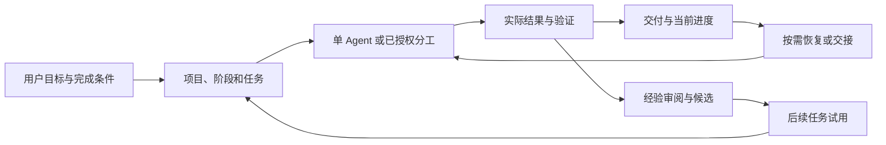

# MALTS 核心设计

本文说明 MALTS 作为整体系统的设计：需要解决什么问题，目标如何分解，交付、调度与成长如何连接，以及当前实现怎样支持这些要求。当前版本为2.0.0；原始历史记录不因本说明重写而改变。准确接口见[状态合同](V2_STATE_CONTRACT.md)，用户路径见[使用指南](USAGE.md)。

## 1. 问题定义

AI Agent 的单次能力与长期项目的可靠交付是不同问题。一个执行者可能解决局部问题，却在后续窗口丢失限制；多个执行者可能同时提供产物，却没有完成整合；一次操作可能已经改变外部状态，却因中断没有返回结果。项目因而需要比临时对话更稳定的目标、进度与验证记录。

MALTS 将这种需要定义为连续性问题：在一次有界执行结束后，下一位执行者必须知道原始目标、现有计划、已经发生的结果、尚未满足的条件，以及可以继续什么。连续性同时包含认知、执行和验证，不能单靠摘要、状态标签或增加 Agent 数量解决。

## 2. 目标与设计原则

**保持目标。** 原始意图、当前理解、排除项和验收条件均可追溯；重大修订明确记录，不让已完成局部工作反过来重定义成功。

**默认采用简单工作路径。** 普通工作由单 Agent 执行，任务清楚后持续推进。项目规模与恢复价值决定需要多少持久状态；报告、交接和深度复盘按实际用途生成。

**使执行可核查、可恢复。** 授权、准备、实际效果与接受分别管理。中断后先确认真实状态，保护用户数据、后续成果和已消费预算。

**分工而不分散责任。** 受控协作可以分离调查、实施和验证，整体计划、资源协调、集成与验收由主 Agent负责。

**用事实判断改进。** 经验具有来源、适用范围和可检验做法；后续任务提供实际结果。中性、有害与不确定结果同样保留，失去依据的经验可以停止复用。

**控制治理成本。** 每项记录、检查或额外执行者应服务于恢复、验证、交付或复用。不要把错误都变成永久提示补丁，不以流程数量衡量质量。

## 3. 整体操作模型

MALTS 将三个过程组织成一套体系。交付过程负责把目标变成符合条件的结果；调度过程负责在轮次、阶段和执行者之间保留进度；成长过程负责判断哪些方法值得以后使用。验证结果是三个过程之间的共同输入。

三者不是要求每轮都执行的固定仪式。简单任务可以只走交付路径；长期工作增加持久进度与恢复；有明确经验信号时才进入复盘；分工有价值且已授权时才启动其他 Agent。

## 4. 工作分层与完成条件

项目定义整体目标和跨阶段接受条件；阶段限定一段工作及其交付；任务描述具体可执行结果。每个层次只接受其范围内的完成证明，任务成功不自动完成阶段，阶段结束也不自动关闭仍需维护的项目。

任务包含目标、相关输入、修改范围、依赖、验收和结果。分解质量取决于输出能否检查，而不是子任务数量。强依赖任务顺序执行；独立任务可以评估并行。新增需求与已经批准范围区分，必要的本地修正不被拆成重复审批。

当前实现使用版本化定义，把任务与准确阶段计划和前置结果相连。其目的在于识别陈旧输入和实际修订，而不是让用户记住内部编号。普通工作通过当前队列和上下文继续；历史材料按明确问题定位。

## 5. 工作流、技能、模板与工具

工作流描述目标澄清、项目设置、长期管理、当前任务、交接、复盘、轻量成长和多 Agent调度。Skill封装对应方法，模板帮助起草记录，检查清单帮助核结果，工具执行可确定的状态与文件操作。它们围绕同一项目工作，不形成平行的状态体系。

Skill不是权限来源。工具可以验证字段和事务条件，但不能替代业务判断；模型可以解释目标并选择方法，但不能用自评产生完成证明；宿主提供实际工具、身份和进程能力，配置声明不等于真实调用已成功。

## 6. 单 Agent、协作与资源

单 Agent优先降低通信、同步和集成开销。独立探索可以提供不同证据，独立验证可以降低同一执行者漏检的风险，分离模块可以并行推进；这些价值需要结合资源与依赖判断。

委派说明目标、输入、允许修改范围、返回格式、预算和验证责任。共享编辑器、文件、服务、环境或设备可能是隐含资源，不能仅根据目录不同认定无冲突。协作先确认宿主能够执行和停止哪些工作，再选择共享、排队、互斥或隔离方式。

主 Agent最终检查实际产物与整合。模型间一致意见、任务返回成功和独立报告都不足以证明集成完成。暂停、取消、接替与进程退出分别管理，保持未知效果和原调用额度，不把新执行轮次当免费重启。

## 7. 成果、报告与交接

成果的内容、所属阶段、版本、来源和依赖分别记录。跨任务共享前核当前内容和资格；替代、失效或退役的成果保留历史解释，不能由旧链接自动升级为另一份当前成果。

报告面向阅读和交付，说明做了什么及其证据；交接面向接续，说明当前状态、未决项与下一步。它们按需从事实生成，保全用户手工内容。发布阅读视图时比较当前来源和目标前像，避免旧报告覆盖新状态。阅读副本修改后，旧hash不能认证新正文。

## 8. 经验、复盘与成长

成长从实际纠正、验证失败、恢复、反复问题或有效方法开始。轻量检查判断是否有必要深入；标准或重大复盘分析原因、适用边界与可改进的做法。普通成功且没有信号时保持静默。

经验候选包含事实来源、适用条件、建议动作、检查方式和停止使用条件。原事件可以支持提出候选，但不能同时充当“未来使用有效”的证明。后续任务需要符合条件、有可比结果和来源；失败、中性和不确定样本保留，反证或来源撤回会停止受影响的复用。

项目记录、经验试用和全局Skill/规则修改有不同授权范围。加密的原始证据不因此变得可公开或可用于成长；传播前需要用途检查和经审阅的派生来源。设计支持受控改进，不预设任何方法都必然有效。

## 9. 运行成本与停止条件

成本包括准备、执行、等待、整合、验证与修复，不能只计模型响应时间。多Agent分工的收益需要扣除协调和集成开销；读取范围变小也不能单由配置推断模型节省了多少token。

控制方法是读取当前所需材料、复用仍有效的证据、按风险选择检查和保持有限范围。预算记录累计消耗，不因恢复而补充。每轮以实际交付、必要决定、检查点或故障停止条件结束；整个目标完成后及时交付，不无限追加旁支。

## 10. 安装、适配、语言与安全

安装将公共载荷放入不可变运行代际，并向各Agent工具提供自己的入口与投影。工具适配保留原生加载和权限方式，共享核心承担共同状态与恢复机制；安装更新、项目采用和实际模型行为分别验证。

用户可读英文或简体中文指南，机器字段保持稳定，项目叙述与手工内容保持原语言。双语文档描述同一状态，不建立两份可写记录。

安全边界包含明确授权、保全重要前像、识别来源、限制受保护内容传播、拒绝陈旧输入以及核外部写者。当前保护使用Windows当前用户DPAPI（数据保护API），因此跨用户恢复另有条件。不可变包体不手改，历史证据不为当前文档一致而重写。

## 11. 当前实现的机制

以下机制说明当前系统怎样落实前述原则；它们属于实现参考，日常使用从工作流进入。

### 11.1. 职责划分与权威

模型解释目标、作业务判断并选择方法；宿主提供工具、权限、进程与身份能力；MALTS 维护状态、依赖、准入、预算、证据和恢复合同。三者各自的声明不能替代其他层的实际结果。

所选 v2 store 是执行事实的单一来源。CLI 和 MCP 经 `v2_service.py` 调用相同领域服务。Project/Phase/Task 定义使用 revision；Phase 绑定实际计划的 SHA-256；Task 依赖指定前置版本。旧 Markdown、报告和交接保持可解释，但不创建第二套可写队列。

Core Schema69 是当前精确读写格式，接口声明位于 `runtime/v2_runtime_contract.json`。早期开发库不能靠修改版本字段升级。已采用工作区的 binding 与 source-seal 用于识别采用边界，不能删除它们来恢复旧运行权威。

### 11.2. 执行、并发与恢复机制

Grant 声明已有授权对应的主体、资源和效果。预算记录累计消耗；新 Run 或恢复不是新的额度。资源准入、lease 和 fencing 用于拒绝受管接口中的陈旧执行者。fencing 指执行者必须持有当前有效的代际或租约标识；它不对未接入这些接口的外部工具提供全局互斥。

操作先准备并绑定请求哈希，再持久保存 intent（即将执行的意图），最后 observe（观察真实结果）。回执缺失时保留 UNKNOWN。UNKNOWN 表示效果不确定，不能解释为失败、未执行或可重试。对账沿原操作身份继续，避免为了重试创建新 ID 造成重复效果。

受管 `create-file` 使用独占创建。Windows `update-file` 比较打开后的当前字节哈希，保全原文，写入后验证；冲突或不确定结果通过原身份处理。文件适配器证明其声明的文件结果，不证明无关网络请求或编辑器保存。

暂停、取消与进程静止分别记录。PAUSED、取消确认、空操作列表和 lease 到期都不能证明外部写者已退出。接替之前核对 Host、未决操作、检查点、epoch 和预算。备份恢复产生新的 epoch（恢复代际）；恢复后的隔离和对账防止旧 Grant、Host 与验收被自动复活。

### 11.3. 完成判定与证据

每项验收 criterion 指定 description、hard、verification_method 和 minimum_evidence_level。`verification.begin` 在操作和 Host 结清后进入 VERIFYING，并阻止新执行。需要修改时用 `verification.rework` 保留旧证据但撤销其当前依据；小任务的 `task.accept` 使用同一检查边界。

证据必须绑定当前 Task 版本、当前 epoch 下已观察的操作、准确 criterion 与来源。证据等级 A–D 按合同比较：较低等级不得冒充独立验证或更高等级。`task-verify` 复核当前证明并保留历史；`NO_LONGER_PROVEN` 表示现在不能继续援引旧完成。

受保护正文存于 blob，描述符限定 owner、目标、敏感性、允许用途与保留规则。当前保护依赖 Windows 当前用户 DPAPI。加密不意味着脱敏，也不自动允许把原始内容用于 Growth。派生证据必须经明确审阅并保留来源链；来源撤销或到期停止后续复用。

### 11.4. 协作、成果与经验

默认单 Agent。需要协作时，控制端分离职责、资源和验收，绑定真实 Host adapter、累计预算与可观察身份；Worker 交付结果，控制端在 Host 结清后验收。传输会话 ID 不是业务 Task、授权或 Run。并行产物存在不表示整合已经完成。

Artifact 的 owner、来源版本、关系和保留用途与文件路径分开。Shared 指经治理允许跨任务复用的成果；当前内容、资格和依赖闭包仍须验证。SUPERSEDED 或 RETIRED 成果可以解释历史，但不能被旧引用自动重定向为新成果或重新启用。

Growth 管理有来源的经验提案、限定试用、未来结果与撤销/退役。正面自评不构成有效方法；中性或有害结果保留。修改全局 Skill 或规则属于另一种授权范围，不能由试用 PASS 推导。

### 11.5. 安装与接口取舍

工具自己的 `MALTS_BOOT.md` 指向不可变代际；discovery 核对 registry、active pointer、identity 和 VERSION。安装计划绑定精确来源与目标前像，隔离 preview 验证后再激活；原位补丁会破坏身份链。公共仓库是通常来源，可选 ZIP 用于离线交付。

精确 Schema 和哈希绑定提高可核查性，代价是升级、旧库采用和恢复必须显式进行。受保护证据减少意外传播，代价是当前跨用户恢复能力有限。持续保留恢复原文可支持解释和修复，但不保证磁盘空间固定有界；诊断清单不产生删除权限。

Skill 用有界路由及 `task`、`phase`、`artifact`、`recovery` 专题组织内容。按需读取降低一次进入所需的材料范围，但不能由配置推断模型实际只读取了该内容或节省了多少 token。

## 12. 验证依据与限制

对应实现见 `tools/v2_state_store.py`、`v2_governance.py`、`v2_operations.py`、`v2_local_host.py`、`v2_acceptance.py`、`v2_evidence_derivation.py`、`v2_artifacts.py`、`v2_growth.py`、`v2_handoff.py` 和 `malts_lifecycle.py`。这些文件解释机制，不能单独替代执行证据。

已记录的验证包括领域/事务/权限/恢复检查、受管文件结果、原生任务与冷恢复、限定串行/并行配对、Growth 未来试用及安装/采用/备份恢复。不同层只支持自己的范围。一个完整的固定 A/C 配对记录了较低自动耗时和输入/输出量，同时工具项更多；B1 原观察 profile 失败仍保留，不能作为完整比较样本。Growth 的真实配对为中性，证明受控试用和停用，不能证明自动收益。

当前不认证总体成功率、普遍或跨宿主因果提速、真实费用/人工节省、Provider 内部请求总量、GUI 模型取消、任意 OS 写者的 fencing、跨用户 DPAPI 恢复或自治发布。对这些限制的保留是对证据适用范围的说明，不改变 Task 的实际验收标准。

操作方法见[使用指南](USAGE.md)；精确状态和错误合同见[状态合同](V2_STATE_CONTRACT.md)。
